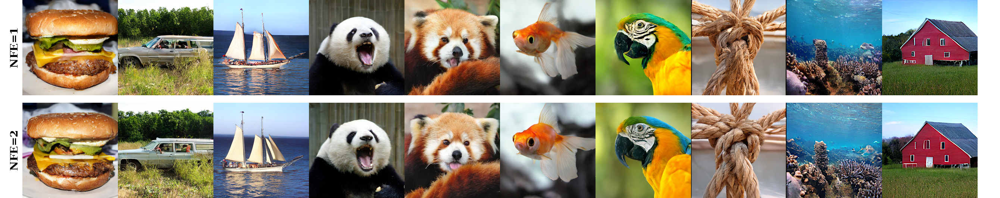

# 
<h2 align="center">
  FACM: Flow-Anchored Consistency Models
</h2>

<h2 align="center">
🔥 FACM outperforms 2×250-step Lightning-DiT on ImageNet 256 with only 2 steps
</h2>

<div align="center">
  <span style="font-size: 1.2em; font-weight: bold;">FID=1.76 (1-step) &nbsp;&nbsp;&nbsp;&nbsp; FID=1.32 (2-step)</span>
</div>


<p align="center">
    <br>
    📄 This is the official implementation of the paper:
    <br>
    <a href="https://arxiv.org/abs/xxxxxx">Flow-Anchored Consistency Models</a>
</p>

<p align="center">
Yansong Peng, Kai Zhu, Yu Liu, Pingyu Wu, Hebei Li, Xiaoyan Sun, Feng Wu
</p>

<p align="center">
<strong>If you like FACM, please give us a ⭐! Your support motivates us to keep improving!</strong>
</p>

<p align="center">
     <br />
    <em> 
    </em>
</p>


## ImageNet 256 Performance on 8 × A100 GPUs

| Model | Steps | FID | IS | Epochs-Pretrain | Epochs-Distill | Download |
|:-----:|:-----:|:---:|:--:|:---------------:|:--------------:|:--------:|
| FACM | 2-step | 1.32 | 292 | 800 | 100 | [100ep-stg2.pt](https://huggingface.co/Peterande/FACM/blob/main/100ep-stg2.pt) |
| FACM | 1-step | 1.76 | 289 | 800 | 250 | [250ep-stg2.pt](https://huggingface.co/Peterande/FACM/blob/main/250ep-stg2.pt) |

## Quick Start

### Prerequisites:

Download the required model weights and statistics files from [HuggingFace](https://huggingface.co/Peterande/FACM/tree/main) or [ModelScope](https://modelscope.cn/models/Peterande/FACM/files) to `./cache`

Including: `fid-50k-256.npz, latents_stats.pt, vavae-imagenet256-f16d32-dinov2.pt`

### Data Preparation

```bash
export DATA_PATH="/path/to/imagenet"
export OUTPUT_PATH="/path/to/latents"
bash scripts/extract.sh
```

*Note: You can also download pre-extracted ImageNet latents following [Lightning-DiT](https://github.com/hustvl/LightningDiT/blob/main/docs/tutorial.md).

### Inference
Download pretrained FACM model checkpoint [100ep-stg2.pt](https://huggingface.co/Peterande/FACM/blob/main/100ep-stg2.pt) and [250ep-stg2.pt](https://huggingface.co/Peterande/FACM/blob/main/250ep-stg2.pt) to `./cache`

```bash
bash scripts/test.sh --ckpt-path cache/100ep-stg2.pt --sampling-steps 2
```
```bash
bash scripts/test.sh --ckpt-path cache/250ep-stg2.pt --sampling-steps 1
```

### Training
Download pretrained FM model checkpoint [800ep-stg1.pt](https://huggingface.co/Peterande/FACM/blob/main/800ep-stg1.pt) to `./cache`

```bash
export DATA_PATH="/path/to/latents"
bash scripts/train.sh
```

### Pretraining (Optional)
Replace [configs/lightningdit_xl_vavae_f16d32.yaml](https://github.com/hustvl/LightningDiT/blob/main/configs/lightningdit_xl_vavae_f16d32.yaml) and [transport/transport.py](https://github.com/hustvl/LightningDiT/blob/main/transport/transport.py) of [Lightning-DiT](https://github.com/hustvl/LightningDiT) with our `ldit/lightningdit_xl_vavae_f16d32.yaml` and `ldit/transport.py`, then follow the [instructions](https://github.com/hustvl/LightningDiT/blob/main/docs/tutorial.md).


## Reproductions
<details open>
<summary> reproductions </summary>

We include reproductions of [MeanFlow](https://arxiv.org/abs/2505.13447) and [sCM](https://arxiv.org/abs/2410.11081). Switch methods by changing the loss function in `train.py` line 81:

```python
facm_loss = FACMLoss()      # FACM (default)
facm_loss = MeanFlowLoss()  # MeanFlow  
facm_loss = sCMLoss()       # sCM
```
</details>

## Citation
If you use `FACM` or its methods in your work, please cite the following BibTeX entries:
<details open>
<summary> bibtex </summary>

```latex
@misc{peng2025facm,
      title={Flow-Anchored Consistency Models},
      author={Yansong Peng and Kai Zhu and Yu Liu and Pingyu Wu and Hebei Li and Xiaoyan Sun and Feng Wu},
      year={2025},
      eprint={x},
      archivePrefix={arXiv},
      primaryClass={cs.CV}
}
```
</details>

## Acknowledgements

The model architecture part is based on the [Lightning-DiT](https://github.com/hustvl/LightningDiT) repository.
